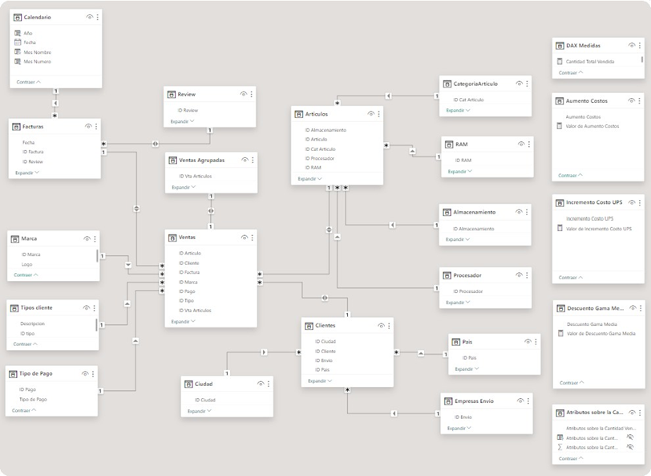

<p align="center">
    
</p>

## ***Proyecto Data Analytics***

***Título del proyecto:*** Análisis de satisfacción en ventas de celulares en la empresa Europe Mobile Distributors.

***Iniciativa de análisis:*** Mejora en la satisfacción de los clientes que manifiestan disconformidad.


***Autora:*** Jesica Brenda Basile

***Formato pdf:*** [Proyecto Final Basile Jesica 49075.pdf](Proyecto%20Final%20-%20Basile%20Jesica%2049075.pdf)  

***Dashboard:*** en [PBI](Dashboard%20Basile%20Jesica%2049075.pbix)

***Fecha de presentación:*** 16/03/2024

## Índice

- [Tabla de versiones](#Tabla-de-versiones)
- [Introducción](#Introducción)
- [Descripción de la temática](#Descripción-de-la-temática)
- [Objetivo](#Objetivo)
- [Alcance](#Alcance)
- [Usuario Final](#Usuario-Final)
- [Diagrama de Entidad-Relación](#Diagrama-de-Entidad-Relación)
- [Herramientas tecnológicas implementadas](#Herramientas-tecnológicas-implementadas)
- [Dataset](#Dataset)
- [Listado de Tablas](#Listado-de-Tablas)
- [Listado de columnas por tablas](#Listado-de-columnas-por-tablas)
- [Modificaciones abordadas en Power Query](#Modificaciones-abordadas-en-Power-Query)
- [Transformaciones de las tablas](#Transformaciones-de-las-tablas)
- [Nuevas tablas incorporadas](#Nuevas-tablas-incorporadas)
- [Diagrama de entidad-relación en Power Bi](#Diagrama-de-entidad-relación-en-Power-Bi)
- [Medidas calculadas](#Medidas-calculadas)
- [Segmentaciones elegidas](#Segmentaciones-elegidas)
- [Análisis funcional del tablero](#Análisis-funcional-del-tablero)
- [Conclusión](#Conclusión)
- [Líneas futuras](#Líneas-futuras)
- [Referencias](#Referencias)

## Tabla de versiones

| VERSIÓN | FECHA       |
|---------|-------------|
| 1       | 30/12/2023  |
| 2       | 13/01/2024  |
| 3       | 24/02/2024  |
| 4       | 16/03/2024  |

## Introduccion

En las últimas décadas, el mercado de teléfonos celulares ha experimentado un crecimiento exponencial, convirtiéndose en un elemento fundamental en la vida moderna. La constante evolución tecnológica, la creciente conectividad y la versatilidad de los dispositivos han transformado la forma en que nos comunicamos, trabajamos y nos entretenemos.

El segmento de telefonía celular se caracteriza por una competencia intensa y una amplia variedad de opciones disponibles, sometida a constantes avances tecnológicos que provocan una rápida obsolescencia de los dispositivos, especialmente los de gama baja, lo que ha generado un aumento continuo en la demanda. Ser referente en este entorno es crucial para la permanencia y el crecimiento, en consecuencia, es importante priorizar la satisfacción al cliente como factor clave para triunfar y expandirse.
En este contexto, Europe Mobile Distributors, es una empresa especializada en la venta de teléfonos celulares en diversos países europeos, que intenta distinguirse por su compromiso con la satisfacción del cliente, la atención personalizada y la comunicación efectiva. La compañía alienta a los consumidores a valorar cada venta, como parte de su enfoque en la mejora continua, para incorporar los cambios necesarios y mantener una experiencia de alta calidad.

## Descripción de la temática

Basándonos en la temática, se busca analizar la información recopilada por Europe Mobile Distributors durante un período de tres años en sus ventas de teléfonos celulares, para valorar el nivel de satisfacción que manifiestan los clientes a través de reseñas asociadas a cada venta, utilizando una puntuación del 1 al 5, con la posibilidad de obtener una calificación nula para aquellos clientes que no proporcionaron valoraciones. Este análisis, no solo alcanza a evaluar la satisfacción de los clientes y correlacionar estos datos con el volumen de venta y las ganancias generadas, sino, adicionalmente, identificar los clientes que evidencian mayor insatisfacción con el fin de desarrollar estrategias comerciales que permitan mejorar la experiencia de esos consumidores e incrementar las ventas.

## Objetivo

El objetivo de este análisis es evaluar la satisfacción de los clientes y su correlación con el volumen y las ganancias de las ventas, a fin de identificar específicamente el nombre y ubicación de los clientes que evidencien mayor insatisfacción para que la empresa pueda desarrollar estrategias comerciales personalizadas con el propósito de mejorar la satisfacción de este grupo concreto de consumidores y aumentar su contribución porcentual al volumen total de ventas.

## Alcance

El dashboard diseñado permitirá acceder a la información sobre la satisfacción de los clientes de la empresa Europe Mobile Distributors ubicados en Europa durante un período de tres años en función de las ventas de teléfonos celulares efectuadas en sus distintas marcas y gamas.
Su utilización, permitirá identificar los nombres y el país de cada uno de los clientes insatisfechos durante el período específico comprendido desde enero del 2019 hasta septiembre del 2021. Estos datos permitirán deducir las estrategias más apropiadas y abordar los cambios necesarios para reducir esa insatisfacción.

## Usuario Final

El tablero de control se encuentra dirigido al nivel táctico, principalmente a los líderes de ventas de la firma Europe Mobile Distributors, dado que facilita la identificación de los clientes disconformes y la ubicación geográfica de los mismos, lo que permitirá al sector comercial diseñar e implementar estrategias para revertir la situación pudiendo generar un incremento en las ventas.

## Diagrama de Entidad-Relación

El diagrama de ER permite visualizar la relación de los datos y de las diferentes tablas. Dentro del mismo, se identifican las claves primarias y foráneas con todos los campos que contienen cada una de las tablas.


## Herramientas tecnológicas implementadas

Para el presente trabajo se utilizaron los siguientes programas:
+ Excel para la lectura del dataset.
+ “Miro” para la creación del diagrama entidad-relación [https://miro.com/es/](https://miro.com/es/)
+ Word para la descripción del proyecto.
+ Power BI Desktop para la creación del tablero de control.

## Dataset

El dataset de Venta de Celulares fue elegido dentro de un grupo de opciones proporcionadas por el profesor a cargo de las clases del curso Martín Segovia, el cual no requería normalización dado que se encontraba óptimo para comenzar a trabajar.

## Listado de Tablas

A continuación, se describen las distintas tablas del modelo especificando [únicamente las llaves primarias y foráneas].

+ ***Tabla Ventas:*** Contiene el detalle de las ventas discriminado el número de factura, cantidad, precio y costo. En el caso de la factura, articulo, marca, cliente y país figuran con sus abreviaciones.

`PK:` ID Venta Articulo `FK:` ID Factura `FK:` ID Articulo `FK:` ID Marca `FK:` ID Cliente `FK:` ID Ciudad `FK:` ID País `FK:` ID Pago `FK:` ID Tipo

+ ***Tabla Artículos:*** Contiene la descripción del artículo, precio y costo, mientras que el artículo, la marca, la categoría, la RAM, almacenamiento y procesador figuran con sus abreviaciones.

`PK:` ID Articulo `FK:` ID Cat Articulo `FK:` ID RAM `FK:` ID Almacenamiento `FK:` ID Procesador 

+ ***Tabla Clientes:*** Contiene nombre del cliente, y abreviaciones de los clientes, ciudades, países y envío.

`PK:` ID Clientes `FK:` ID Envío

+ ***Tabla procesador:*** Contiene la descripción de los distintos procesadores, con sus abreviaciones campo ID Procesador.

`PK:` ID Procesador

+ ***Tabla Almacenamiento:*** Contiene los cuatro tamaños de almacenamiento 256GB, 128GB, 64GB y 32 GB con sus abreviaciones campo ID Almacenamiento.

`PK:` ID Almacenamiento

+ ***Tabla RAM:*** Contiene los cinco tamaños de memoria RAM 12GB, 8GB, 6GB, 4GB y 2GB con sus abreviaciones campo ID RAM.

`PK:` ID RAM

+ ***Tabla Categoría Artículo:*** Contiene las tres categorías de gama sobre los artículos Alta, Media y Baja con sus abreviaciones campo ID Categoría Articulo.

`PK:` ID Categoría Artículo

+ ***Tabla Tipo Pago:*** Contiene los cuatro diferentes medios de pago Efectivo, Crédito, Transferencia y Cheque con sus abreviaciones campo ID Pago.

`PK:` ID Pago

+ ***Tabla País:*** Contiene cinco países europeos España, Portugal, Italia, Francia y Alemania en los que se encuentran ubicados los clientes, con sus abreviaciones campo ID País.

`PK:` ID País

+ ***Tabla Ciudad:*** Contiene las distintas ciudades en las que se encuentran ubicados los clientes, con sus abreviaciones campo ID Ciudad.

`PK:` ID Ciudad.

+ ***Tabla Marca:*** Contiene las seis marcas Apple, Samsung, Google, Xiaomi, Huawei y Motorola de los artículos que se comercializan, con sus abreviaciones campo ID Marca.

`PK:` ID Marca

+ ***Tabla Facturas:*** Contiene los números de facturas y fechas de todas las ventas de celulares efectuadas en la compañía “Europe Mobile Distributors” desde el año 2019 al 2021 inclusive, con sus abreviaciones sobre las facturas, los pagos y los review.

`PK:` ID Factura `FK:` ID Review

+ ***Tabla Review:*** Contiene las puntuaciones None, 1, 2, 3, 4 y 5 sobre las valoraciones efectuadas por los clientes que revelan su satisfacción, donde None hace referencia a la ausencia de valoración por parte del consumidor.

`PK:` ID Review

## Listado de columnas por tablas

***VENTAS***

| CAMPO              | TIPO DE DATO    | TIPO DE CLAVE |
|--------------------|-----------------|---------------|
| ID Venta Artículos  | INT             | PK            |
| Nro Factura         | VARCHAR(20)     |               |
| ID Factura          | INT             | FK            |
| ID Articulo         | INT             | FK            |
| ID Marca            | INT             | FK            |
| ID Cliente          | INT             | FK            |
| ID Ciudad           | INT             | FK            |
| ID País             | INT             | FK            |
| Cantidad            | INT             |               |
| Precio USD          | DECIMAL(5,2)    |               |
| Coste USD           | DECIMAL(5,2)    |               |
| ID Pago             | INT             | FK            |
| ID Tipo             | INT             | FK            |

***ARTÍCULOS***

| CAMPO             | TIPO DE DATO    | TIPO DE CLAVE |
|-------------------|-----------------|---------------|
| ID Articulo       | INT             | PK            |
| ID Marca          | INT             |               |
| Des Articulo      | VARCHAR(100)    |               |
| Precio USD        | DECIMAL(5,2)    |               |
| Coste USD         | DECIMAL(5,2)    |               |
| ID Cat Articulo   | INT             | FK            |
| ID RAM            | INT             | FK            |
| ID Almacenamiento | INT             | FK            |
| ID Procesador     | INT             | FK            |


***CLIENTES***

| CAMPO           | TIPO DE DATO | TIPO DE CLAVE |
|-----------------|--------------|---------------|
| ID Cliente      | INT          | PK            |
| Nombre Cliente  | TEXT(50)     |               |
| ID Ciudad       | INT          |               |
| ID Pais         | INT          |               |
| ID Envio        | INT          | FK            |

***TIPOS DE CLIENTES***

| CAMPO       | TIPO DE DATO | TIPO DE CLAVE |
|-------------|--------------|---------------|
| ID Tipo     | INT          | PK            |
| Descripcion | TEXT(50)     |               |

***EMPRESAS ENVIO***

| CAMPO    | TIPO DE DATO | TIPO DE CLAVE |
|----------|--------------|---------------|
| ID Envio | INT          | PK            |
| Empresas | TEXT(50)     |               |

***PROCESADOR***

| CAMPO        | TIPO DE DATO   | TIPO DE CLAVE |
|--------------|----------------|---------------|
| ID Procesador| INT            | PK            |
| Procesador   | VARCHAR(100)   |               |

***ALMACENAMIENTO***

| CAMPO          | TIPO DE DATO   | TIPO DE CLAVE |
|----------------|----------------|---------------|
| ID Almacenamiento | INT          | PK            |
| Almacenamiento    | VARCHAR(50)  |               |

***RAM***

| CAMPO  | TIPO DE DATO   | TIPO DE CLAVE |
|--------|----------------|---------------|
| ID RAM | INT            | PK            |
| RAM    | VARCHAR(10)    |               |

***CATEGORIA ARTÍCULO***

| CAMPO             | TIPO DE DATO | TIPO DE CLAVE |
|-------------------|--------------|---------------|
| ID Cat Articulo   | INT          | PK            |
| Categoria Articulo| TEXT(10)     |               |

***TIPO DE PAGO***

| CAMPO         | TIPO DE DATO | TIPO DE CLAVE |
|---------------|--------------|---------------|
| ID Pago       | INT          | PK            |
| Tipo de Pago  | TEXT(50)     |               |

***PAÍS***

| CAMPO     | TIPO DE DATO | TIPO DE CLAVE |
|-----------|--------------|---------------|
| ID Pais   | INT          | PK            |
| Pais      | TEXT(50)     |               |

***CIUDAD***

| CAMPO      | TIPO DE DATO | TIPO DE CLAVE |
|------------|--------------|---------------|
| ID Ciudad  | INT          | PK            |
| Ciudad     | TEXT(50)     |               |

***MARCA***

| CAMPO      | TIPO DE DATO | TIPO DE CLAVE |
|------------|--------------|---------------|
| ID Ciudad  | INT          | PK            |
| Ciudad     | TEXT(50)     |               |

***FACTURAS***

| CAMPO        | TIPO DE DATO  | TIPO DE CLAVE |
|--------------|----------------|---------------|
| ID Factura   | INT            | PK            |
| Nro Factura  | VARCHAR(20)    |               |
| Fecha        | DATETIME       |               |
| ID Pago      | INT            |               |
| ID Review    | INT            | FK            |

***REVIEW***

| CAMPO      | TIPO DE DATO | TIPO DE CLAVE |
|------------|--------------|---------------|
| ID Review  | INT          | PK            |
| Review     | VARCHAR(10)  |               |

## Modificaciones abordadas en Power Query

Una vez exportadas las tablas en Power Bi y durante el proceso de elaboración del dashboard se identificó la necesidad de efectuar diversas modificaciones desde Power Query para mejorar la calidad de la información y exposición en el tablero de control.

## Transformaciones de las tablas

+ ***Tabla Empresas Envío:*** La modificación incorporada sobre la tabla envío consistió en la incorporación de una nueva columna denominada “Imagen”, cuyo tipo de dato es texto, y contiene los URL de imágenes en formato png para utilizarlas en la visualización ChicleySlicer. La fórmula condicional elaborada es la siguiente:
```sql
Imagen = if [ID Envio] = 1 then "https://raw.githubusercontent.com/VanFolken/img_logos/main/DHL.png" else if [ID Envio] = 2 then "https://raw.githubusercontent.com/VanFolken/img_logos/main/FEDEX.png" else if [ID Envio] = 3 then "https://raw.githubusercontent.com/VanFolken/img_logos/main/UPS.png" else if [ID Envio] = 4 then "https://raw.githubusercontent.com/VanFolken/img_logos/main/DB- SCHENKER.png" else if [ID Envio] = 5 then "https://raw.githubusercontent.com/VanFolken/img_logos/main/TNT.png" else "Otro")
```

+ ***Tabla Facturas:*** Se incorporaron dos columnas “Tipo Review” y “Nivel Conformidad” con tipo de dato texto. En la primera se clasifican los ID Review en seis categorías a las que se les asigna un nombre específico, y en la segunda se agrupa en categorías más amplias, de acuerdo a las siguientes fórmulas:
```sql
Tipo Review = if [Tipo Review] = "Insatisfecho" or [Tipo Review] = "Poco Satisfecho" then "Disconforme" else if [Tipo Review] = "Satisfecho" or [Tipo Review] = "Muy Satisfecho" then "Conforme" else if [Tipo Review] = "Neutro" then "Neutro" else "Sin Reseña"
```
```sql
Nivel Conformidad = if [ID Review] = 1 then "Sin Calificar" else if [ID Review] = 2 then "Insatisfecho" else if [ID Review] = 3 then "Poco Satisfecho" else if [ID Review] = 4 then "Neutro" else if [ID Review] = 5 then "Satisfecho" else "Muy Satisfecho")
```

+ ***Tabla Marca:*** Se añadió una columna denominada “Logo”, cuyo tipo de dato es texto, y contiene los URL de imágenes en formato png para utilizarlas en la visualización ChicleySlicer. La fórmula utilizada es la siguiente:
```sql
Logo = if [ID Marca]= 1 then "https://raw.githubusercontent.com/VanFolken/img_logos/main/APPLE.png" else if [ID Marca] = 2 then "https://raw.githubusercontent.com/VanFolken/img_logos/main/SAMSUNG.png" else if [ID Marca] = 3 then "https://raw.githubusercontent.com/VanFolken/img_logos/main/GOOGLE.png"else if [ID Marca] = 4 then "https://raw.githubusercontent.com/VanFolken/img_logos/main/XIAOMI.png" else if [ID Marca] = 5 then "https://raw.githubusercontent.com/VanFolken/img_logos/main/HUAWEI.png" else if [ID Marca] = 6 then "https://raw.githubusercontent.com/VanFolken/img_logos/main/MOTOROLA.png" else "Otro").
```

+ ***Tabla Ventas:*** Se insertaron dos columnas calculadas de tipo decimal que arrojan como resultados el Total Parcial Ventas y el Total Parcial Costos. Las fórmulas utilizadas son las siguientes:
```sql
Total Parcial Ventas = [Precio ud] * [Cantidad]
Total Parcial Costos = [Coste ud] * [Cantidad]
```

## Nuevas tablas incorporadas

Se incorporaron diversas tablas con distinta finalidad en DAX que son detalladas a continuación:

+ ***Tabla DAX Medidas:*** Es la tabla que contiene todas las medidas calculadas utilizadas para el diseño de las visualizaciones en el dashboard.

+ ***Tabla Calendario:*** Se trata de una tabla calculada que contiene un total de cuatro columnas cuyos datos abarcan desde enero 2019 a septiembre 2021 (se delimita el período, puesto que de lo contrario los gráficos con fechas mostraban datos nulos de noviembre a diciembre).
A continuación, se detallan las columnas con sus correspondientes fórmulas calculadas:
```sql
Fecha = CALENDAR(DATE(2019, 1, 1), DATE(2021, 9, 30))
Año = YEAR(Calendario[Fecha])
Mes número = MONTH(Calendario[Fecha])
Mes nombre = LEFT(UPPER(FORMAT(Calendario[Fecha], "MMM")), 1) & MID(FORMAT(Calendario[Fecha], "MMM"), 2, 2)
```

+ ***Tabla Aumento Costos:*** Se creó a través de un parámetro numérico bajo el cual se aplicó un formato porcentual y permite la creación de un segmentador que facilita la simulación de aumentos porcentuales sobre los costos totales.
```sql
Aumento de costos = GENERATESERIES(0, 1.01, 0.01)
Valor de aumento de costos = SELECTEDVALUE('Aumento Costos'[Aumento Costos])
```

+ ***Tabla Incremento Costo UPS:*** Fue creada a través de un parámetro numérico con un formato porcentual que permite la creación de un segmentador que facilita la simulación de aumentos porcentuales sobre una sola variable de los costos. La variable afectada es aquella que corresponde a los clientes que utilizan la empresa de envíos UPS (usuarios que manifestaron mayor insatisfacción, y puede presumirse una relación causal), con la finalidad de simular un escenario en el que Europe Mobile Distributors pueda responsabilizarse por la erogación del traslado.
```sql
Incremento Costo UPS = GENERATESERIES(0, 1.01, 0.01)
Valor de aumento de costos = SELECTEDVALUE('Incremento Costo UPS'[Incremento Costo UPS])
```

+ ***Tabla Descuento Gama Media:*** Se originó a través de un parámetro numérico con formato porcentual que permite la creación de un segmentador que facilita la simulación de descuentos porcentuales sobre una sola variable de las ventas. La variable afectada es aquella que corresponde a los clientes que adquieren artículos de gama media (sobre la que se identificó menor demanda), de ese modo, Europe Mobile Distributors puede simular el impacto que los descuentos pueden provocar en las ganancias con la finalidad de estimular las ventas.
```sql
Descuento de Gama Media =GENERATESERIES(0, 1.01, 0.01)
Valor de Descuento Gama Media = SELECTEDVALUE('Descuento Gama Media'[Descuento Gama Media])
```

+ ***Tabla Atributos sobre la Cantidad Vendida:*** Se trata de una tabla creada a través de un parámetro de campo que permite la creación de un segmentador que filtra la cantidad total vendida por marca o por país, según corresponda.
```sql
Atributos sobre la Cantidad Vendida = {("Marca Articulo", NAMEOF('Marca'[Marca Articulo]), 0), ("País", NAMEOF('Pais'[País]), 1)}
```

+ ***Tabla Ventas Agrupadas:*** Es una tabla creada con la finalidad de agrupar las ventas de acuerdo al número de ID Venta Artículo, para ser utilizada en los cálculos estadísticos, es decir, medidas de tendencia central.
```sql
Ventas Agrupadas = SUMMARIZE(Ventas, Ventas[ID Vta Articulos], "Valor Venta Agrupada", SUM(Ventas[Total Parcial Ventas]))
```

## Diagrama de entidad-relación en Power Bi


El diagrama de ER fue modificado respecto el diseño original, puesto que, durante la elaboración del tablero, se detecto la necesidad de cambiar algunas relaciones entre tablas. Se trasladaron las relaciones de las tablas de “Envio” y “Ciudad” hacia “Clientes” (en lugar de Ventas como estaba inicialmente). El cambio se implementó por el descubrimiento de la existencia de clientes inactivos que no figuraban en la tabla de hechos, y eso evitaba que pudiera conocerse la ubicación geográfica de los mismos.



## Medidas calculadas

Se crearon un total de 32 medidas calculadas diferentes. Las mismas se encuentran agrupadas en dos carpetas dentro de “DAX Medidas” y sus nombres fueron elegidos acorde a los datos que proporcionan en las visualizaciones.


A continuación, se detalla la fórmula de calculo sobre cada medida y su finalidad específica.

---
***MEDIDAS GENERALES***
---
***Medida:*** _Cantidad Total Vendida_
```sql
VAR _cantidadtotalvendida = SUM(Ventas[Cantidad]) RETURN
IF(ISBLANK(_cantidadtotalvendida), 0, _cantidadtotalvendida)
```
***Finalidad:*** Esta medida fue creada a través de una variable para sumar la cantidad total vendida de la columna Cantidad que se encuentra en la tabla Ventas. Al final de la fórmula se aplica una restricción, para que en caso que el resultado sea “en blanco” de cero y al segmentar figure el número en lugar de la palabra.

---
***Medida:*** _Cantidad Total Vendida Año Anterior_
```sql 
CALCULATE([Cantidad Total Vendida], DATEADD(Calendario[Fecha], -1, YEAR))
```
***Finalidad:*** Esta medida permite calcular la cantidad vendida acumulada hasta el año anterior, para ser utilizada en la visualización “Scroller” del mapa que figura en la página productos que permite mostrar numéricamente ese escenario comparativo.

---
***Medida:*** _Cliente Activos_
```sql 
VAR _activos = CALCULATE(DISTINCTCOUNT('Ventas'[ID Cliente])) RETURN
IF(ISBLANK(_activos), 0, _activos)
```
***Finalidad:*** A través de la introducción de una variable, esta medida calcula la cantidad de clientes a los que se les realizaron ventas, asegurándose de no contar clientes de forma duplicada. Al final de la fórmula se aplica una restricción, para que en caso que el resultado sea “en blanco” de cero y al segmentar figure el número en lugar de la palabra.

---
***Medida:*** _Clientes Inactivos_
```sql
VAR _inactivos = ([Total Clientes] - [Clientes Activos]) RETURN
IF(HASONEVALUE('Tipos Cliente'[ID Tipo]), 0,
IF(ISBLANK(_inactivos), 0, _inactivos))
```
***Finalidad:*** Esta medida se realiza a través de una variable que resta dos medidas calculadas generadas anteriormente, y permite obtener la cantidad de clientes a los que no se les efectuaron ventas, puesto que figuran en la tabla Clientes, pero no en la tabla Ventas. Asimismo, se coloca una restricción solicitando que se evalúe si en la tabla Tipos de Cliente existe un valor que especifique el tipo del que se trata, y si no lo hay que arroje el valor cero.
Esta restricción se incorporó dado que los clientes inactivos solo figuran en la tabla Clientes, y los Tipos de clientes solo figuran en la tabla Ventas, en consecuencia, no puede saberse la clase de cliente que son los inactivos. Por último, al final de la fórmula también figura otra restricción, para que en caso que el resultado sea “en blanco” de cero y al segmentar figure el número en lugar de la palabra.

---
***Medida:*** _Costo Total Desglosado por Empresa de Envío_
```sql
VAR _DHL = CALCULATE(SUMX(FILTER('Ventas', RELATED('Clientes'[ID Envio]) = 1), 'Ventas'[Total Parcial Costos]))
VAR _Fedex = CALCULATE(SUMX(FILTER('Ventas', RELATED('Clientes'[ID Envio]) = 2), 'Ventas'[Total Parcial Costos]))
VAR _UPS = CALCULATE(SUMX(FILTER('Ventas', RELATED('Clientes'[ID Envio]) = 3), 'Ventas'[Total Parcial Costos])) * (1 + 'Incremento Costo UPS'[Valor de Incremento Costo UPS])
VAR _Schenker = CALCULATE(SUMX(FILTER('Ventas', RELATED('Clientes'[ID Envio]) = 4), 'Ventas'[Total
Parcial Costos]))
VAR _TNT = CALCULATE(SUMX(FILTER('Ventas', RELATED('Clientes'[ID Envio]) = 5), 'Ventas'[Total Parcial Costos]))
VAR _TotalCostos = _DHL + _Fedex + _UPS + _Schenker + _TNT
RETURN
IF(ISBLANK(_TotalCostos), 0, _TotalCostos * (1 + 'Aumento Costos'[Valor de Aumento Costos]))
```
***Finalidad:*** Se crearon en total de 6 variables, dentro de las cuales 5 corresponden a los costos de los productos que se venden a los clientes que utilizan determinadas empresas de envío. Sobre la empresa UPS se aplica un parámetro numérico que permite incrementarlo a través de una segmentación. La última variable, realiza una suma de todas las anteriores y en su retorno también se aplica un parámetro numérico que permite incrementar el total de los costos para explorar futuros
escenarios. Por último, al final de la fórmula también figura otra restricción, para que en caso que el resultado sea “en blanco” de cero y al segmentar figure el número en lugar de la palabra.

---
***Medida:*** _Disconformes_
```sql
VAR _disconforme = CALCULATE(COUNTROWS('Facturas'), 'Facturas'[ID Review] > 1 && 'Facturas'[ID Review] < 4)
RETURN
IF(ISBLANK(_disconforme), 0, _disconforme)
```
***Finalidad:*** Esta medida a través de una variable cuenta la cantidad de facturas que tienen un ID Review mayor a 1 y menor a 4, puesto que los ID Review 2 y 3 son los clientes “Insatisfechos” y “Poco Satisfechos” considerados como disconformes. Al final de la fórmula se aplica una restricción, para que en caso que el resultado sea “en blanco” de cero y al segmentar figure el número en lugar de la palabra.

---
***Medida:*** _Disconformes Año Anterior_
```sql 
CALCULATE([Disconformes], DATEADD(Calendario[Fecha], -1, YEAR))
```
*** Finalidad:*** Esta medida busca obtener la cantidad acumulada en años anteriores de clientes disconformes para ser utilizada en una visualización KPI que permita observar esa comparación.

---
***Medida:*** _Etiqueta Positiva_
```sql
IF([Disconformes] = 0, UNICHAR(128994), BLANK())
```
***Finalidad:*** Esta medida fue creada con la finalidad de utilizarse como una etiqueta en visualizaciones donde se requiere una indicación visual para manifestar alguna situación en particular. En el dashboard elaborado se utiliza en el gráfico donde se muestra el total de reseñas en comparación a las reseñas disconformes para indicar (con un círculo verde) los meses en los que no hubo reseñas negativas. El código 128994 fue extraído de la página web [https://www.vertex42.com/ExcelTips/unicode-symbols.html](https://www.vertex42.com/ExcelTips/unicode-symbols.html).

---
***Medida:*** _Ganancia Total_
```sql 
[Venta Total Desglosada por Gama] - [Costo Total Desglosado por Empresa Envio]
```
***Finalidad:*** Esta medida se calcula restando dos medidas calculadas anteriormente, para obtener como resultado la ganancia total del período analizado.

---
***Medida:*** _Reseñas Promedio_
```sql
IFERROR(DIVIDE([Total Review], [Clientes Activos]), 0) + 0
```
***Finalidad:*** Esta medida calcula el cociente entre dos medidas calculadas anteriormente, cuyo resultado proporciona el promedio de las reseñas efectuadas por los clientes. Se toma la precaución de utilizar “IFERROR” por tratarse de una división, para evitar cualquier inconveniente si el divisor (en este caso Clientes Activos) fuera cero.

---
***Medida:*** _Titulo Tooltip_
```sql
SELECTEDVALUE(CategoriaArticulo[Categoria Articulo]
```
***Finalidad:*** Tal como indica su nombre, esta medida es utilizada para el título dinámico de un tooltip cuya finalidad es indicar la gama de los celulares que adquirieron ciertos clientes que no efectuaron reseñas sobre sus operaciones.

---
***Medida:*** _Titulo Tooltip2_
```sql    
SELECTEDVALUE(Facturas[Tipo Review])
```
***Finalidad:*** Esta medida calculada es utilizada como título dinámico para un tooltip que refleje el nivel de satisfacción (insatisfechos y poco satisfechos) que tienen los clientes disconformes que son listados en esa visualización.

---
***Medida:*** _Titulo Tooltip4_
```sql
SELECTEDVALUE('Tipos cliente'[Descripcion])
```
***Finalidad:*** Esta medida calculada es utilizada como título dinámico para un tooltip que refleje el tipo de cliente involucrado en una visualización.

---
***Medida:*** _Titulo Tooltip5_
```sql 
SELECTEDVALUE(Pais[País])
```
***Finalidad:*** Esta medida calculada es utilizada como título dinámico para un tooltip que revela el país de los clientes activos que se ven involucrados en la visualización en la que se aplica.

---
***Medida:*** _Total Clientes_
```sql
VAR _totalclientes = COUNTROWS(Clientes) RETURN
IF(ISBLANK(_totalclientes), 0, _totalclientes)
```
***Finalidad:*** Esta medida refleja a través de una variable la cantidad total de clientes que figuran en la tabla Clientes contados a través de la cantidad de filas que posee. Al final de la fórmula figura una restricción, para que en caso que el resultado sea “en blanco” de cero y al segmentar figure el número en lugar de la palabra.

---
***Media:*** _Total Facturas_
```sql
VAR _totalfacturas = COUNTROWS(Facturas) RETURN
IF(ISBLANK(_totalfacturas), 0, _totalfacturas)
```
***Finalidad:*** Esta medida se calcula por medio de una variable que arroja el número total de facturas emitidas en el período analizado. Al final de la fórmula se aplica una restricción, para que en caso que el resultado sea “en blanco” de cero y al segmentar figure el número en lugar de la palabra.

---
***Medida:*** _Total Review_
```sql
VAR _totalreview = CALCULATE(
[Total Facturas], FILTER(
Facturas,
Facturas[ID Review] <> 1))
RETURN
IF(ISBLANK(_totalreview), 0, _totalreview)
```
***Finalidad:*** Esta medida se calcula a través de una variable que arroja el total de facturas que tienen reseñas comprendidas entre los ID Review mayores a uno, dado que las facturas con ID Review igual a uno no poseen reseñas y por esa razón son excluidas. Asimismo, al final de la fórmula se aplica una restricción, para que en caso que el resultado sea “en blanco” de cero y al segmentar figure el número en lugar de la palabra.

---
***Medida:*** _Venta Total Desglosada por Gama_
```sql
VAR _AltaGama =
CALCULATE(SUMX(FILTER(Ventas,Ventas[ID Articulo] >= 1 && Ventas[ID Articulo] <= 5),Ventas[Total Parcial Ventas]))
VAR _MediaGama = CALCULATE(SUMX(FILTER(Ventas,Ventas[ID Articulo] >= 6 && Ventas[ID Articulo] <= 10),Ventas[Total Parcial Ventas])) * (1 - 'Descuento Gama Media'[Valor de Descuento Gama Media]) VAR _BajaGama = CALCULATE(SUMX(FILTER(Ventas,Ventas[ID Articulo] >= 11 && Ventas[ID Articulo] <= 15),Ventas[Total Parcial Ventas]))
RETURN
_AltaGama + _MediaGama + _BajaGama
```
***Finalidad:*** Es una medida que por medio de 3 variables calcula el valor recaudado por todas las ventas comprendidas dentro del período analizado discriminando la gama del producto involucrado en la operación. Sobre la variable de gama media se aplica un parámetro porcentual que descuenta para evaluar posibles escenarios de descuento a fin de incentivar las ventas de esa categoría en específico.

---
***Medida:*** _Ventas Sin Reseñas_
```sql
VAR _ventasinresenas = CALCULATE( COUNTROWS(Facturas), Facturas[ID Review] = 1)
RETURN
IF(ISBLANK(_ventasinresenas), 0, _ventasinresenas)
```
***Finalidad:*** Esta medida se obtiene con ayuda de una variable encargada de contar la cantidad de facturas que fueron emitidas, pero no fueron calificadas por los clientes. A su vez, al final de la fórmula se aplica una restricción, para que en caso que el resultado sea “en blanco” de cero y al segmentar figure el número en lugar de la palabra.

---
***MEDIDAS DE TENDENCIA CENTRAL***
---
***Medida:*** _Cuartil 1_
```sql
PERCENTILE.INC('Ventas Agrupadas'[Valor Venta Agrupada], 0.25)
```
***Finalidad:*** Esta medida permite calcular el valor del primer cuartil sobre las Ventas Agrupadas. Proporciona información sobre la distribución de los datos.

---
***Medida:*** _Cuartil 3_
```sql
PERCENTILE.INC('Ventas Agrupadas'[Valor Venta Agrupada], 0.75)
```
***Finalidad:*** Esta medida permite calcular el valor del tercer cuartil sobre las Ventas Agrupadas. Proporciona información sobre la distribución de los datos.

---
***Medida:*** _CV_
```sql
DIVIDE([Desvio STD], [Venta Promedio MTC])-1
```
***Finalidad:*** Esta medida permite calcular el coeficiente de variación a través de un cociente entre el Desvio Standard y las Ventas Promedio MTC. Se resta uno para que el resultado se arroje en porcentaje, y es negativo dado que la media es bastante superior a la desviación standard.

---
***Medida:*** _Desvio STD_
```sql
STDEV.P('Ventas Agrupadas'[Valor Venta Agrupada])
```
***Finalidad:*** Esta medida permite calcular la desviación standard de las Ventas Agrupadas. Representa la distancia promedio que existe entre la media y los puntos individuales de nuestros registros.

---
***Medida:*** _Empresa de Envio Más utilizada_
```sql
VAR _masutilizada = TOPN(1, SUMMARIZE(Ventas, 'Empresas Envio'[Empresa]), [Total Facturas], DESC) RETURN
UNICHAR(128667) & " " & _masutilizada
```
***Finalidad:*** Esta medida calculada proporciona a través de una variable el nombre de la Empresa de Envíos que más se utiliza en las transacciones comerciales efectuadas. Asimismo, la información se expone con un ícono (de un camión) con el código 128667 que fue extraído de la página web [https://www.vertex42.com/ExcelTips/unicode-symbols.html](https://www.vertex42.com/ExcelTips/unicode-symbols.html).

---
***Medida:*** _Ganancia Obtenida con Disconformidad_
```sql
VAR _disconformes = [Disconformes] VAR _ganancia_disconforme =
SUMX(
FILTER(
'Facturas',
'Facturas'[ID Review] > 1 && 'Facturas'[ID Review] < 4
),
CALCULATE([Ganancia Total])
) RETURN
IF(_disconformes > 0, _ganancia_disconforme, 0)
```
***Finalidad:*** Esta medida calculada a través de dos variables permite obtener solo la ganancia obtenida sobre las ventas que fueron calificadas en forma negativa (disconformes).

---
***Medida:*** _Marca Más Vendida_
```sql
VAR _masvendido = TOPN(1, SUMMARIZE(Ventas, Marca[Marca Articulo]), [Cantidad Total Vendida], DESC)
RETURN
UNICHAR(128241) & " " & _masvendido
```
***Finalidad:*** Esta medida proporciona el nombre de la marca que vendió mayor cantidad de productos. La información se expone junto al ícono de un celular con el código número 128241 extraído del sitio web: [https://www.vertex42.com/ExcelTips/unicode-symbols.html](https://www.vertex42.com/ExcelTips/unicode-symbols.html).

---
***Medida:*** _Titulo Marca Producto_
```sql
VAR _Marcaproducto = SELECTEDVALUE(Marca[Marca Articulo]) RETURN
IF(_Marcaproducto = BLANK(), "Todas", _Marcaproducto)
```
***Finalidad:*** Esta medida expone el nombre de la Marca que se encuentra filtrada en la página Conclusiones cuando se deriva desde los Atributos de la Cantidad Vendida en la pestaña Productos.

---
***Medida:*** _Titulo Ubicación Geográfica_
```sql
VAR _ubicacionpais = SELECTEDVALUE(Pais[País]) RETURN
IF(_ubicacionpais = BLANK(), "Europa", _ubicacionpais)
``` 
***Finalidad:*** Esta medida – al igual que la anterior – expone el País que se encuentra filtrado en la página conclusiones cuando se deriva desde los Atributos de la Cantidad Vendida en la pestaña Productos.

---
***Medida:*** _Venta Mediana MTC_
```sql
MEDIAN('Ventas Agrupadas'[Valor Venta Agrupada])
```
***Finalidad:*** Esta medida permite obtener el valor de la Mediana, es decir, el valor del centro del conjunto de Ventas Agrupadas.

---
***Medida:*** _Venta Moda Frecuencia MTC_
```sql
VAR _Tabla_Agrupada = SUMMARIZE('Ventas Agrupadas', 'Ventas Agrupadas'[Valor Venta Agrupada], "Recuento", COUNTROWS('Ventas Agrupadas'))
VAR _Maximo = MAXX(_Tabla_Agrupada, [Recuento]) RETURN
_Maximo
```
***Finalidad:*** Esta medida se obtiene a través de 2 variables, donde la primera permite determinar la cantidad de veces (recuento) que se repite cada valor en la columna Valor Venta Agrupada en la tabla de Ventas Agrupadas, mientras que la segunda variable identifica el máximo de los recuentos que se obtuvo anteriormente. De ese modo, se determina la frecuencia de la moda que será utilizada para sacar conclusiones en comparación con las demás medidas de tendencia central.

---
***Medida:*** _Venta Moda MTC_
```sql
VAR _Tabla_Agrupada = SUMMARIZE('Ventas Agrupadas', 'Ventas Agrupadas'[Valor Venta Agrupada], "Recuento", COUNTROWS('Ventas Agrupadas'))
VAR _Maximo = MAXX(_Tabla_Agrupada, [Recuento])
VAR _Moda = FILTER(_Tabla_Agrupada, [Recuento] = _Maximo) RETURN
UNICHAR(128181) & " " & CONCATENATEX(_Moda, 'Ventas Agrupadas'[Valor Venta Agrupada], " " & UNICHAR(119131) & " ")
```
***Finalidad:*** Esta medida se compone de 3 variables. La primera determina la cantidad de veces (recuento) que se repite cada valor en la columna Valor Venta Agrupada en la tabla de Ventas Agrupadas, la segunda variable calcula el máximo de los recuentos que se obtuvo anteriormente, y la tercera variable busca el valor de la venta que más se repite en la tabla agrupada a través del filtrado de la tabla agrupada cuando el recuento sea igual al máximo. De ese modo, se obtiene el valor de la moda, y posteriormente se concatenan las modas que logran detectarse.

---
***Medida:*** _Venta Promedio MTC_
```sql
AVERAGE('Ventas Agrupadas'[Valor Venta Agrupada])
```
***Finalidad:*** Esta medida calcula el promedio de los valores que están en la tabla de Ventas Agrupadas, en la columna Valor Venta Agrupada para poder compararlo luego con las demás medidas de tendencia y sacar conclusiones al respecto.

---
## Segmentaciones elegidas

En consideración al objetivo y alcance del proyecto, se utilizaron distintas segmentaciones por página para facilitar el análisis:

***Páginas de reseñas***


En la pestaña reseñas se crearon 2 segmentadores para filtrar por año y por empresa de envíos, lo que permite determinar las fluctuaciones que se experimentaron en las reseñas durante el año seleccionado y el nivel de satisfacción cuando intervienen las distintas empresas de envíos involucradas en cada venta que fue reseñada.

***Páginas Clientes***


En la pestaña clientes se incluyeron 4 segmentadores para profundizar el análisis. En año permite identificar con mayor precisión la cantidad de ventas/facturas y reseñas que se realizaron durante el año seleccionado, mientras que las empresas de envíos facilita identificar la cantidad de clientes que usan cada proveedor de flete y si se tratan de clientes activo o inactivos, en el caso de la gama facilita la identificación de los clientes que adquieren las distintas categorías de los productos, y por último, el tipo de pago que revela los medios de pago más utilizados y priorizados por los consumidores.

## Análisis funcional del tablero

La cantidad de hojas que tiene el dashboard se diseñó en función de las distintas perspectivas que se pretendían abordar en el análisis: reseñas, clientes y productos. A su vez, se anexa el menú de inicio, glosario y conclusiones.

---
***Página Portada***

La portada es el menú principal del tablero, y se compone de botones interactivos que derivan a las distintas páginas del tablero.


---
***Página Reseñas***

Esta página se enfoca en el análisis de las reseñas de los clientes y su nivel de conformidad.


Uno de los tooltips que contiene la página permite identificar particularmente los nombres y la ubicación de los clientes para posteriormente poder contactarlos y profundizar la información sobre el origen de su disconformidad. A su vez, se expone por otro tooltip los clientes que no efectuaron reseñas, que aunque se trata de un número poco significativo, será recomendable comunicarnos y solicitar amablemente si pueden efectuar sus calificaciones para que nuestro análisis sea lo más objetivo posible.

---
***Tooltip Facturas Sin Reseña***

La visualización tipo embudo que muestra la cantidad de facturas sin reseña discriminadas por gama, contiene un tooltip que explaya información detallada con los nombres de los clientes que no realizaron esa valoración y la cantidad de operaciones que hicieron.


---
***Tooltip Disconformes***

La visualización gráfico de anillos sobre la cantidad de reseñas disconformes, contiene un tooltip que proporciona el listado de los clientes que efectuaron reseñas de tipo “Insatisfechos” y “Poco Satisfechos”; esto permite distinguir el nombre de cada cliente y la cantidad de reseñas negativas que efectuó.


---
***Tooltip Distribución Geográfica Clientes Disconformes***

La visualización mapa de la página reseñas contiene un tooltip que revela el nombre de las clientes que efectuaron valoraciones disconformes, con la cantidad de reseñas totales por país. De ese modo, se identifica con claridad las ubicaciones geográficas con mayor concentración de clientes disconformes, en este caso, España con 16.


---
***Página Productos***

Esta página focaliza el análisis del total de las ventas, costos, ganancia y cantidad total vendida pudiendo filtrar de acuerdo a las empresas de envío y marcas. También se muestra la cantidad vendida según las gamas y el tamaño de las memorias de los equipos móviles.


---
***Tooltip Cantidad Vendida***

La visualización gráfico de anillos sobre la cantidad vendida en la página productos discrimina la cantidad vendida según las gamas de los celulares y posee un tooltip que además de indicar en su título la categoría de la que se trata, muestra un detalle de la conformidad en forma numérica y porcentual.


---
***Atributos sobre la cantidad vendida***

La página productos tiene un segmentador creado a través de un parámetro de campo, que facilita el filtrado de la visualización del gráfico de barras agrupado, pudiendo luego, derivar a la página conclusiones aplicando ese filtro.


---
***Página Clientes***

La página de clientes centra su análisis en detectar la cantidad de clientes totales, activos, inactivos, la evolución de las ventas, un listado de los clientes inactivos con sus id para identificar que se trata de los clientes más recientes incorporados y la distribución geográfica de los clientes activos. Toda esa información puede ser clasificada según el tipo de cliente, para elaborar conclusiones, así como también 4 segmentadores que habilitan profundizar aún más las conclusiones.


---
***Tooltip Ventas por Tipo de Cliente***

La visualización matríz de ventas por tipo de cliente no solo muestra las ventas totales y las cantidades totales que los distintos tipos de clientes efectuaron, sino que además contiene un tooltip que expande esa información discriminando el nombre del cliente, las ventas y cantidades totales proporcionales a cada uno.


---
***Tooltip Distribución de los Clientes Activos***

La visualización mapa de la página clientes no solo muestra la distribución y concentración geográfica de los clientes activos en los diferentes países, sino que, además, contiene un tooltip que expande información proporcionando el nombre del cliente, la ciudad y la ganancia total. Esto facilita identificar los ingresos que genera cada cliente según la ciudad y país al que pertenece.


---
***Página Conclusiones***

La página conclusiones muestra diversas medidas de tendencia central para su comparación y posterior interpretación. Asimismo, se exhibe la marca más vendida, la empresa de envíos más utilizada en las operaciones y la ganancia obtenida por las ventas que obtuvieron reseñas negativas. Por último, cuenta con dos top 5 de clientes para no solo ubicar los más disconformes, sino además, evaluar si son aquellos que efectúan mayor cantidad de compras.


---
***Página Glosario***

El glosario muestra información relevante para que el usuario conozca el objetivo y alcance del proyecto, así como también las definiciones clave de los íconos que aparecen en las visualizaciones y las abreviaciones que tienen algunos segmentadores creados con parámetros numéricos.


---

## Conclusión

Luego de la elaboración del dashboard y su análisis, se concluye que si bien el porcentaje de disconformidad total es bajo (18,07%), la identificación específica de los nombres y ubicaciones de los clientes a través de los tooltips brinda la posibilidad al nivel táctico de ventas de contactarse con ellos e indagar con mayor profundidad el motivo de sus reseñas negativas. Asimismo, en el análisis concreto de los clientes, se detectaron 7 usuarios inactivos que poseen los número de id más recientes, es decir, se trata de los últimos nuevos clientes que se incorporaron a nuestros registros y desde los últimos 3 años no consumen productos de la empresa Europe Mobile Distributors, y si bien, no se logra identificar particularmente el momento en el que dejaron de operar, será recomendable comunicarse para investigar el motivo y poder revertir la situación siempre que sea posible. Sobre éste último punto, cabe destacar que 3 clientes de los inactivos adquirían sus productos a través de la empresa de envíos “Schenker” – siendo los únicos clientes que utilizaban ese proveedor de envíos -, por lo que será relevante descartar si el motivo de su inactividad tiene algún vínculo causal con ello.
Por otra parte, el tablero brinda información sobre los clientes que no efectuaron reseñas, otorgando la posibilidad de contactarlos con un recordatorio para que puedan efectuar su valoración y mejorar nuestro análisis.
En relación a los productos, se detecta que la marca más vendida es Samsung y que la gama media es la menos comercializada, en consecuencia, el dashboard brinda la posibilidad de simular descuentos para evaluar si se justificar efectuar bonificaciones para fomentar el consumo de esa categoría de productos.
En cuanto a los costos, el tablero posibilita la recreación de escenarios de aumento en el total de los costos para evaluar la posibilidad de hacerse cargo de los envíos de los productos para mejorar las reseñas, y/o también solo responsabilizarse del traslado sobre los clientes que utilizan la empresa UPS. Respecto a las medidas de tendencia central puede afirmarse que se trata de una distribución asimétrica hacia la derecha, dado que la moda es significativamente menor que la media y la mediana.

## Líneas futuras

El dashboard no solo revela información para la toma de decisiones principalmente sobre la disconformidad de los clientes, sino que además se identifican ciertos detalles que si son modificados podrían mejorar aún más la calidad de información, tales como: incorporar en la tabla clientes los tipos de clientes para identificar el tamaño de los clientes inactivos (que no figuran en la tabla ventas). A su vez, resulta interesante investigar si existen otras empresas de envío con las que se pudiera comenzar a operar y ver si de ese modo la satisfacción de los clientes mejora aún más, y por último, podría evaluarse la posibilidad de enviar encuestas anuales a los clientes para obtener informes más amplios y profundos que permitan tomar decisiones para mejorar la experiencia del usuario.

## Referencias

[https://docs.google.com/spreadsheets/d/1nATe3Mp5-cR3_D7_6NR32b0ZcKobmHGj/edit#gid=1167329443](https://docs.google.com/spreadsheets/d/1nATe3Mp5-cR3_D7_6NR32b0ZcKobmHGj/edit#gid=1167329443).

[https://miro.com/es/ ](https://miro.com/es/).

[https://www.vertex42.com/ExcelTips/unicode-symbols.html](https://www.vertex42.com/ExcelTips/unicode-symbols.html).
